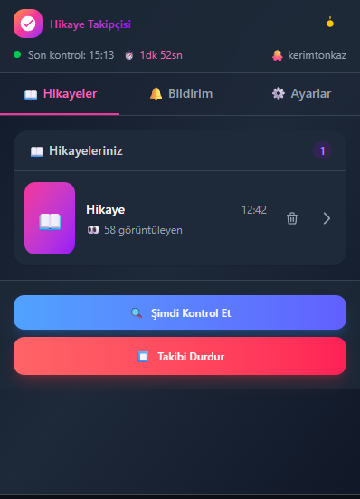
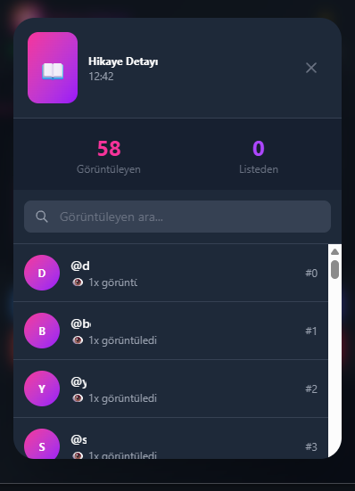
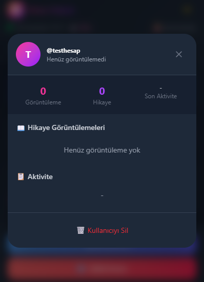
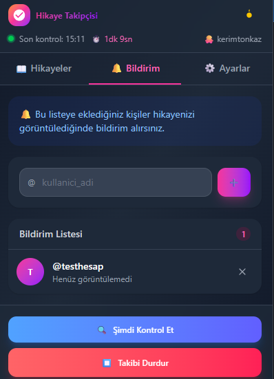
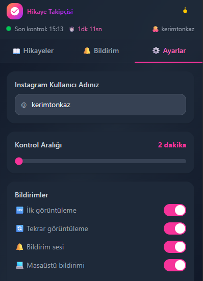

# 📸 Instagram Story Tracker

<div align="center">


**Kendi Instagram hikayelerinizi kimlerin görüntülediğini takip edin ve önemli kişiler baktığında anında bildirim alın!**

**[📥 Chrome Web Store'dan İndir](https://chromewebstore.google.com/detail/Instagram%20Hikaye%20Takip%C3%A7isi/hfflglfcpcnddakpibpkfdfljpkgbcoe)**

[Özellikler](#-özellikler) •
[Kurulum](#-kurulum) •
[Kullanım](#-kullanım) •
[Ekran Görüntüleri](#-ekran-görüntüleri) •
[Teknik Detaylar](#-teknik-detaylar)

</div>

---

## 📸 Ekran Görüntüleri

<div align="center">

### 📖 Hikayeler


*Aktif hikayelerinizi ve görüntüleyen sayılarını görün*

### 👀 Hikaye Detayı


*Her hikayeyi kimlerin gördüğünü detaylı inceleyin*

### 🔍 Görüntüleyen Detayı


*Kullanıcının görüntüleme geçmişini takip edin*

### 🔔 Bildirim Listesi


*Önemli kişileri takip listesine ekleyin*

### ⚙️ Ayarlar


*Eklentiyi ihtiyaçlarınıza göre özelleştirin*

</div>

---

## ✨ Özellikler

### 🔔 Akıllı Bildirim Sistemi
- **İlk görüntüleme bildirimi** - Takip listenizdeki biri hikayenizi ilk kez gördüğünde
- **Tekrar görüntüleme algılama** - Aynı kişi hikayenize tekrar baktığında (Instagram'ın sıralama algoritmasını kullanarak)
- **Masaüstü bildirimleri** - Chrome bildirim sistemi ile
- **Ses bildirimi** - Özelleştirilebilir bildirim sesi

### � Otomatik Engelleme Sistemi (YENİ!)
- **Engel takibi** - Sizi engelleyen kişilerin profilini periyodik olarak kontrol eder
- **Otomatik engelleme** - Engeli kaldırdıklarında otomatik olarak onları engeller
- **Özelleştirilebilir kontrol aralığı** - 10-300 saniye arası ayarlanabilir
- **Durum takibi** - Her hedefin durumunu gerçek zamanlı görün
- **Bildirim** - Engelleme başarılı olduğunda masaüstü bildirimi

### �📊 Detaylı Takip
- Tüm görüntüleyenlerin listesi
- Her görüntüleyicinin kaç kez baktığı
- Pozisyon değişimi takibi
- Hikaye bazlı istatistikler

### 🎨 Modern Arayüz
- Instagram tarzı gradient tasarım
- Açık/Koyu tema desteği
- Responsive popup arayüzü
- Smooth animasyonlar ve geçişler
- Gerçek zamanlı progress bar ile sonraki kontrol göstergesi

### 🌐 Çoklu Dil Desteği
- **Türkçe** - Tam Türkçe arayüz
- **English** - Full English interface
- Tek tıkla dil değiştirme
- Seçilen dil otomatik kaydedilir

### ⚙️ Özelleştirme
- Kontrol aralığı ayarı (2-60 dakika)
- Bildirim türlerini açıp kapatma
- Ses bildirimi kontrolü
- Takip listesi yönetimi
- Dil seçimi (Türkçe/English)

---

## 🚀 Kurulum

### Gereksinimler
- Google Chrome (veya Chromium tabanlı tarayıcı)
- Aktif bir Instagram hesabı

### Adım Adım Kurulum

1. **Projeyi İndirin**
   ```bash
   git clone https://github.com/kerimtonkaz/instagram-story-tracker.git
   ```
   veya ZIP olarak indirin ve çıkarın.

2. **Chrome'da Extensions Sayfasını Açın**
   ```
   chrome://extensions
   ```

3. **Geliştirici Modunu Aktifleştirin**
   - Sağ üst köşedeki "Developer mode" toggle'ını açın

4. **Eklentiyi Yükleyin**
   - "Load unpacked" butonuna tıklayın
   - `instagram-story-tracker` klasörünü seçin

5. **Hazır!** 🎉
   - Araç çubuğunda pembe-mor gradient ikonunu göreceksiniz

---

## 📖 Kullanım

### İlk Kurulum

1. **Eklenti ikonuna tıklayın**
2. **⚙️ Ayarlar sekmesine gidin**
3. **Instagram kullanıcı adınızı girin** (@ olmadan)
4. **Kontrol aralığını ayarlayın** (varsayılan: 5 dakika)

### Bildirim Listesi Oluşturma

1. **🔔 Bildirim sekmesine gidin**
2. **Takip etmek istediğiniz kullanıcı adlarını ekleyin**
3. Bu kişiler hikayenizi gördüğünde bildirim alacaksınız

### Takibi Başlatma

1. **Ana sayfadaki "▶️ Başlat" butonuna tıklayın**
2. Otomatik kontroller belirlenen aralıkta çalışacak
3. Progress bar ile sonraki kontrole kalan süreyi görün

### Manuel Kontrol

- **"Manuel Kontrol"** butonuyla istediğiniz zaman kontrol yapabilirsiniz
- Hikaye sayfası otomatik açılır, veriler çekilir ve sekme kapatılır

### 🚫 Otomatik Engelleme Kullanımı (YENİ!)

Bu özellik, sizi engelleyen kişilerin engelini kaldırıp kaldırmadığını kontrol eder ve kaldırdıklarında otomatik olarak onları engeller.

**Ne zaman kullanılır?**
- Birini engellediniz, o da sizi engelledi
- Sonra siz engeli kaldırdınız ama mesajları sildiğiniz için tekrar engelleyemiyorsunuz
- Karşı taraf hala sizi engellediği için profilini göremiyorsunuz

**Nasıl çalışır?**
1. **🚫 Oto-Engel sekmesine gidin**
2. **Engellemek istediğiniz kullanıcı adını girin**
3. **Kontrol aralığını ayarlayın** (varsayılan: 30 saniye)
4. **"🔒 Oto-Engeli Başlat" butonuna tıklayın**

**Durum göstergeleri:**
- ⏳ **Bekliyor** - Profil hala "mevcut değil" durumunda (engel devam ediyor)
- 🎯 **Profil açık** - Engel kaldırılmış, engelleme başlatılıyor
- ✓ **Engellendi** - Başarıyla engellendi
- ⚠ **Hata** - Bir sorun oluştu

**İşlem akışı:**
```
1. Profil sayfasına git (instagram.com/kullanici_adi)
2. "Profile mevcut değil" mi kontrol et
   - Evet → Engel devam ediyor, tekrar bekle
   - Hayır → Profil açık!
3. Seçenekler (⋯) butonuna tıkla
4. "Engelle" butonuna tıkla
5. Onay ekranında tekrar "Engelle" butonuna tıkla
6. Başarılı! Masaüstü bildirimi gönder
```

---

## 🧠 Tekrar Görüntüleme Algoritması

Instagram'da hikaye görüntüleyenler listesi **son bakanlar en üstte** olacak şekilde sıralanır. Bu özelliği kullanarak tekrar görüntülemeyi tespit ediyoruz:

```
Kontrol 1: @kerimtonkaz sırası = 5 (listede 5. sırada)
Kontrol 2: @kerimtonkaz sırası = 8 (başkaları baktı, aşağı düştü)
Kontrol 3: @kerimtonkaz sırası = 2 (tekrar üste çıktı!)
           → SONUÇ: @kerimtonkaz hikayeye TEKRAR baktı! 🎉
```

---

## 🔧 Teknik Detaylar

### Proje Yapısı

```
instagram-story-tracker/
├── manifest.json           # Chrome Extension Manifest V3
├── popup/
│   ├── popup.html          # Ana popup arayüzü
│   └── popup.js            # UI mantığı ve state yönetimi
├── background/
│   └── background.js       # Service worker, alarm yönetimi
├── content/
│   ├── content.js          # Instagram sayfa etkileşimi
│   └── content.css         # In-page bildirim stilleri
├── utils/
│   ├── helpers.js          # Yardımcı fonksiyonlar
│   ├── storage.js          # Chrome storage işlemleri
│   ├── notifications.js    # Bildirim sistemi
│   ├── viewer-tracker.js   # Görüntüleyici takip algoritması
│   ├── alarms.js           # Zamanlayıcı yönetimi
│   ├── instagram.js        # Instagram tab işlemleri
│   ├── i18n.js             # Çoklu dil desteği (🇹🇷/🇬🇧)
│   └── auto-block.js       # Otomatik engelleme modülü
├── content/
│   ├── content.js          # Instagram hikaye sayfası etkileşimi
│   ├── content.css         # In-page bildirim stilleri
│   └── auto-block-content.js # Profil engelleme content script
├── assets/
│   ├── icons/              # Extension ikonları
│   └── sounds/             # Bildirim sesleri
└── lib/
    └── iziToast/           # Toast bildirim kütüphanesi
```

### Kullanılan Teknolojiler

- **Chrome Extension Manifest V3**
- **ES Modules** - Modern JavaScript modül sistemi
- **Tailwind CSS** - Utility-first CSS framework
- **iziToast** - Toast bildirimleri için
- **Chrome APIs**:
  - `chrome.storage.local` - Veri saklama
  - `chrome.alarms` - Periyodik kontroller
  - `chrome.notifications` - Masaüstü bildirimleri
  - `chrome.scripting` - Content script enjeksiyonu
  - `chrome.offscreen` - Ses çalma (arka planda)

### Gerekli İzinler

| İzin | Açıklama |
|------|----------|
| `storage` | Kullanıcı verilerini saklamak için |
| `alarms` | Periyodik kontroller için |
| `notifications` | Masaüstü bildirimleri için |
| `tabs` | Instagram sekmelerini yönetmek için |
| `scripting` | Görüntüleyici çıkarma scripti için |
| `offscreen` | Arka planda ses çalmak için |

---

## 🛠️ Geliştirme

### Projeyi Çalıştırma

```bash
# Projeyi klonlayın
git clone https://github.com/kerimtonkaz/instagram-story-tracker.git

# Klasöre gidin
cd instagram-story-tracker

# Bağımlılıkları yükleyin (opsiyonel - Tailwind için)
npm install

# Tailwind'i watch modunda çalıştırın
npx tailwindcss -i ./input.css -o ./popup/popup.css --watch
```

### Debug

1. `chrome://extensions` sayfasını açın
2. Eklentinin altındaki "Service worker" linkine tıklayın
3. Console'da logları inceleyin

---

## ⚠️ Önemli Notlar

- Bu eklenti sadece **kendi hikayelerinizi** takip etmek içindir
- Instagram'ın kullanım koşullarına uygun kullanın
- Çok sık kontrol yapmak hesabınızı riske atabilir (minimum 2 dakika önerilir)
- Instagram arayüzü değişirse eklenti güncelleme gerektirebilir

---

## 🤝 Katkıda Bulunma

1. Bu repo'yu fork edin
2. Feature branch oluşturun (`git checkout -b feature/amazing-feature`)
3. Değişikliklerinizi commit edin (`git commit -m 'Add amazing feature'`)
4. Branch'i push edin (`git push origin feature/amazing-feature`)
5. Pull Request açın

---

## 📄 Lisans

Bu proje MIT lisansı altında lisanslanmıştır. Detaylar için [LICENSE](LICENSE) dosyasına bakın.

---

## 🙏 Teşekkürler

- [iziToast](https://izitoast.marcelodolza.com/) - Güzel toast bildirimleri için
- [Tailwind CSS](https://tailwindcss.com/) - Harika utility-first CSS framework
- [Heroicons](https://heroicons.com/) - Güzel ikonlar için

---

<div align="center">

**⭐ Bu projeyi beğendiyseniz yıldız vermeyi unutmayın!**

Made with 💖 by [Kerim TONKAZ](https://github.com//kerimtonkaz)

</div>